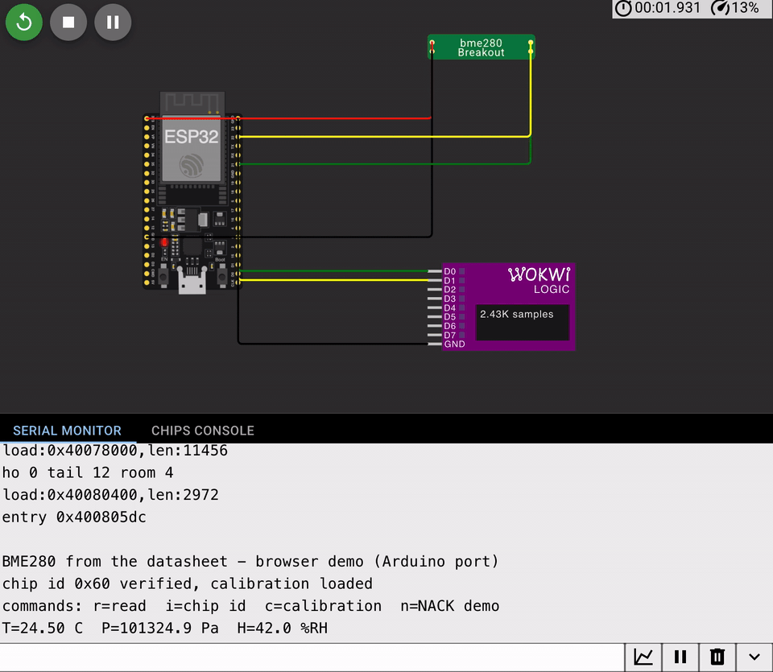

# bme280-driver-from-datasheet

An I2C BME280 environmental-sensor driver for the ESP32 written from the
datasheet's register map with no vendor library — chip-id verification that
rejects a stuck bus, both calibration banks including the interleaved
dig_H4/dig_H5, the section 8.2 fixed-point compensation, and an error model
in which every failure path is fault-injected and branch-coverage-gated on
every commit.

[](https://github.com/DwalloE/bme280-driver-from-datasheet/actions/workflows/ci.yml)



## Run it in your browser

No hardware needed.

**Simulator:** _saved Wokwi project link lands here_ — press play, then
type `r` (read), `i` (chip id), `c` (calibration dump) or `n` (NACK demo)
into the serial monitor. One honest caveat, same as projects 01 and 02:
Wokwi's browser editor compiles Arduino, not ESP-IDF, so that project runs
[`browser-demo/sketch.ino`](browser-demo/sketch.ino), a clearly-labeled
port whose transport is Wire.h — the register map, calibration parsing and
fixed-point compensation are the same arithmetic; the fault-injected bus
layer is not there, because it is the host suite's job. The sensor in that
project is this repo's own custom chip
([`chip/bme280.chip.c`](chip/bme280.chip.c) + `.json`, added to the Wokwi
project as a custom chip), since Wokwi ships no BME280. The canonical
driver is [`main/bme280.c`](main/bme280.c); CI builds it under ESP-IDF
v5.3 and runs it against Wokwi's simulated BME280 on every commit,
requiring compensated readings the firmware itself judged plausible.

**Locally:**

```bash
# Host tests - no toolchain beyond cc and make. These are the interesting part.
make -C test        # naive-driver controls must fall into the traps,
                    # 65 injected faults must surface as the mapped error,
                    # every branch in bme280.c must be taken both ways

# Firmware - needs ESP-IDF v5.3+
idf.py set-target esp32
idf.py build && idf.py uf2     # -> build/uf2.bin, which Wokwi flashes
```

## What it does

[`main/bme280.c`](main/bme280.c) talks to the sensor through an injected
three-function bus interface and nothing else — the ESP-IDF `i2c_master`
binding in [`main/main.c`](main/main.c) is ~50 lines, and the same driver
file compiles unchanged against the fault-injection mock on the host. Why
that layering is the whole point (and how it becomes a Zephyr module in
project 09): [`docs/bus-interface.md`](docs/bus-interface.md).

```
I (330) bme280-demo: probe 0x77 (SDO high): no ACK, as expected - that NACK is in the trace
I (340) bme280-demo: chip id 0x60 verified, calibration loaded (dig_T1=28960 dig_H4=321)
I (350) bme280-demo: forced mode: trigger, poll status.measuring, read
bme280: T=24.50 C  P=101324.9 Pa  H=42.0 %RH  -> plausible
I (2360) bme280-demo: normal mode: free-running, standby 500 ms, filter off
I (10370) bme280-demo: alive t=10s
```

## What this demonstrates

- **A driver written from a register map, not a library call.** Chip id,
  soft reset, the im_update wait, ctrl_hum's latch-on-ctrl_meas ordering
  quirk (section 5.4.3), forced vs normal mode, standby and IIR filter
  config — each register write cites the datasheet section it implements.
- **The calibration traps, tested.** dig_T1/dig_P1 are unsigned where
  their neighbours are signed (parse dig_T1 as `int16_t` and every reading
  is wrong by whole degrees); dig_H4/dig_H5 are 12-bit values interleaved
  across three bytes with the sign bit in the [11:4] byte. The suite
  parses hostile values through all of it.
- **Fixed-point compensation transcribed from section 8.2** — int32
  temperature and humidity, int64 pressure, Bosch's own variable names so
  it diffs against the reference — pinned to the datasheet's worked
  example (25.08 °C, 100653.25 Pa) and cross-checked against an
  independent implementation of the section 8.1 double-precision formulas.
- **An error model where a timeout is not a NACK**, and the plausible-but-
  wrong reading is treated as the most dangerous failure: a stuck bus
  returns 0xFF with a clean transport status, which is a valid-looking
  chip id to any driver that doesn't compare. Stage 0 of the suite proves
  a naive driver falls for it; only then does this one get credit for not.
- **The simulated sensor is this repo's own custom chip.** Wokwi has no
  built-in BME280, so [`chip/bme280.chip.c`](chip/bme280.chip.c)
  implements the register file, access protocol, forced/normal timing and
  worked-example calibration from the same datasheet — and inverts the
  section 8.2 compensation numerically so the diagram's physical-unit
  attrs come back out of the firmware's arithmetic. Driver and chip are
  two independent readings of the document, and
  [`chip/test_chip.c`](chip/test_chip.c) makes CI prove they meet:
  [`chip/README.md`](chip/README.md).
- **Fault injection as the control mechanism.** The mock bus can aim any
  of five fault types at any single bus transaction; the sweep walks every
  fault along every operation of init, configure and measure — 65 cases —
  and the gcov gate then refuses any branch in `bme280.c` not taken both
  ways. "Handles errors" is a claim about every call site, not the first.

## The wire, captured

Wokwi's logic analyzer sits on the bus (D0 = SDA, D1 = SCL;
`wokwi.toml` writes `i2c-trace.vcd`). The firmware makes the captures
worth keeping by design: boot probes 0x77 — where nothing lives — so every
trace contains a real address NACK (SDA high through the 9th clock)
alongside the healthy 0x76 traffic; then three forced conversions and the
switch to normal mode. Annotated captures land in `docs/traces/`, and
[`docs/i2c-failure-modes.md`](docs/i2c-failure-modes.md) is the field
guide: what each failure looks like on the wire, what it looks like from
firmware, and which `bme280_err_t` it becomes.

## The bug gallery

| Bug | Symptom | Where |
|---|---|---|
| Accepting 0xFF as a chip id | A stuck or empty bus "initialises" cleanly, then ships readings compensated from 0xFF calibration garbage | stage-0 control: the naive driver does exactly this; the real driver returns `BAD_ID` — [`test/test_bme280.c`](test/test_bme280.c) |
| dig_T1 parsed as signed | 65000 becomes −536; t_fine follows; T, P **and** H are all wrong, but only on sensors whose calibration word is > 32767 — some units work fine, which is worse | stage 1: hostile calibration images through the real parser |
| dig_H4/H5 nibble order swapped | Humidity garbage at some temperatures and plausible at others (the split shares byte 0xE5; the sign bit lives in the [11:4] byte) | stage 1: negative H4/H5 encoded and parsed back |
| dig_H5 read from 0xE7, dig_H6 from 0xE6 | This repo's own first cut swapped the two — exactly the off-by-one the interleaved layout invites; humidity would have been silently wrong | caught by the stage-1 parsing test before ever producing a number — commit `0f1d3e4` |
| Ignoring a mid-transfer NACK | The first calibration bank reads fine, the second doesn't, and the driver limps on with half an image | stage 3: every fault walked along every one of init's six transactions |
| `if (var1 == 0) return 0` presented as weather | Corrupt dig_P1 yields 0 Pa with a clean status; the datasheet's own guard hides the corruption | the driver keeps the guard but returns `BAD_CALIB` — the reading is refused, not reported |
| Reading data registers byte-by-byte | Two consecutive reads can straddle a measurement update and mix two samples | `bme280_read()` burst-reads all 8 bytes, as section 4 requires |

## How it is tested

| Test | Asserts | Runs |
|---|---|---|
| stage 0 controls | the naive driver MUST wrongly succeed against a stuck bus and an empty bus (else the harness can't detect the trap), then the real driver must reject both | CI, every commit |
| stage 1 calibration | endianness, the unsigned dig_T1/dig_P1 traps, negative dig_H4/H5 through the split encoding | CI, every commit |
| stage 2 compensation | fixed-point pinned to the worked example (25.08 °C / 100653.25 Pa) + double-reference cross-check at two operating points | CI, every commit |
| stage 3 fault sweep | 5 fault types × every bus operation of init/configure/measure = 65 cases, each surfacing as the mapped error; poll-budget success and exhaustion both ways | CI, every commit |
| stage 4 identity/args | BMP280 id rejected, erased-NVM calibration rejected, dig_P1=0 divide guard, every argument check, humidity clamps at 0 and 100 %RH | CI, every commit |
| coverage gate | 100% of branches in `bme280.c` taken both ways (gcov), or the build fails | CI, every commit |
| chip vs driver | the driver's I2C traffic replayed against the custom chip: two independent section-8.2 implementations must round-trip five operating points within quantisation | CI, every commit |
| `idf.py build` | the same `bme280.c` compiles for ESP32 under ESP-IDF v5.3 | CI, every commit |
| Wokwi CI scenario | the custom-chip BME280 on a simulated ESP32: the 0x77 NACK demo, chip id verified, a compensated reading the firmware judged plausible (5 < T < 45 °C), the switch to normal mode, and the t=10s heartbeat that outlives the 5 s task watchdog | CI, when `WOKWI_CLI_TOKEN` is set |

Host tests need only `cc` and `make`. The simulation step needs a free
[Wokwi CI token](https://wokwi.com/dashboard/ci) and is skipped without
one, so the suite still runs on a fork.

## Honest limits

- **A simulated sensor returns configured values.** Wokwi's BME280 hands
  back whatever the diagram sets; nothing here validates real sensor
  accuracy, self-heating (the real part warms itself ~0.5 °C at high
  oversampling), long-term drift, or a real part's calibration spread.
- **The VCD shows protocol, not analog signal integrity.** A trace proves
  edges and ACK bits in the right order; it says nothing about bus
  capacitance, rise times against the 400 pF budget, marginal pull-ups, or
  the noise environment — which is what a scope on real hardware is for.
- **The mock's faults are clean.** Real buses produce messier failures —
  runt pulses, glitches inside a byte, a NACK that reads as a timeout at a
  different HAL layer. The mock proves the driver's *response* to each
  named failure class; taxonomy on real silicon belongs to a bench.
- **Timing is asserted only coarsely.** The scenario proves conversions
  complete and the watchdog stays quiet; it does not measure conversion
  time against datasheet table 13, bus utilisation, or interrupt latency.

## Why this project exists

Third of eleven in a deliberately-sequenced embedded portfolio, moving from
ESP-IDF (which I ship professionally on 10,000+ fielded devices) into
bare-metal STM32 register work, Zephyr on nRF52840, and embedded Linux.
This driver returns in project 09 as an out-of-tree Zephyr module — the
injected bus interface is what makes that a packaging exercise instead of
a rewrite. Index:
[`embedded-portfolio`](https://github.com/DwalloE/embedded-portfolio).

## Layout

```
main/bme280.h             the interface: bus ops, error model, register map.
main/bme280.c             the driver. gated at 100% branch coverage.
main/main.c               ESP-IDF v5.3 i2c_master binding + the demo app.
test/mock_bus.c           the fault-injection bus: any fault, any transaction.
test/test_bme280.c        controls first, then calibration/compensation/sweep.
chip/bme280.chip.c        the simulated sensor itself, from the same datasheet.
chip/test_chip.c          chip vs driver: the two 8.2 implementations must meet.
docs/bus-interface.md     why the bus is injected; the road to the Zephyr port.
docs/i2c-failure-modes.md each failure, on the wire and in the error model.
wokwi-ci.scenario.yaml    CI demands plausible readings from the simulated part.
browser-demo/sketch.ino   Arduino-core port for the shareable Wokwi project.
```

MIT licensed.
